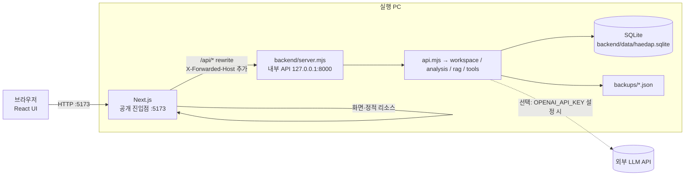
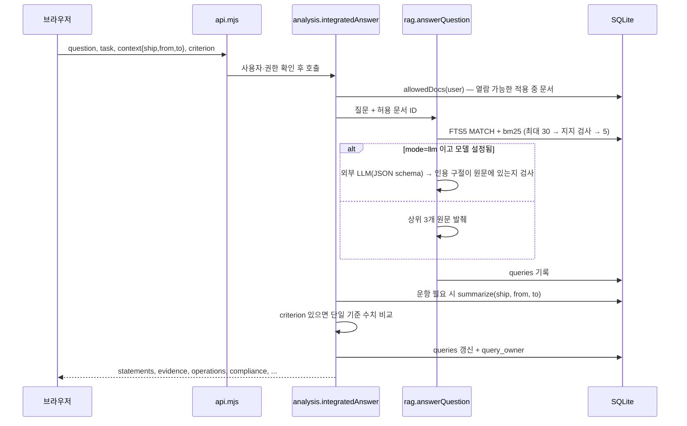

# 아키텍처

> 대상 버전: 1.4.0 · 최종 확인: 2026-10-08 (코드 대조)
> 이 문서는 **현재 구현**을 설명합니다. 앞으로 바꿀 계획은 [`plans/`](plans/), 바뀌지 않을 결정의 이유는 [`adr/`](adr/)에 있습니다.

## 1. 한눈에 보기

해답은 한 대의 PC에서 도는 **로컬 웹 애플리케이션**입니다. 프로세스는 두 개이고, 사용자는 **Next.js 주소 하나**(기본 `http://127.0.0.1:5173`)로만 접속합니다. Next.js가 화면을 그리고, `/api/*` 요청은 `rewrites`로 내부 API 서버(`127.0.0.1:8000`)에 넘깁니다([ADR 0006](adr/0006-nextjs-entry-rewrites-to-api.md)).

- **일반 실행** `npm start` → `scripts/run.mjs`가 API 서버(`--port 8000 --public-port 5173`)와 `next start frontend -p 5173`을 함께 띄우고, 하나가 죽으면 둘 다 종료합니다. Windows의 `start.cmd` → `scripts/start.ps1` → (필요 시 `npm ci`, `npm run build`) → `scripts/run.mjs`.
- **개발 실행**은 두 프로세스를 각각 띄웁니다([ADR 0005](adr/0005-dev-mode-direct-processes.md)). `npm run dev:backend` = `node --watch backend/server.mjs`, `npm run dev:frontend` = `next dev frontend --webpack -H 127.0.0.1 -p 5173`.
- **API 주소**: `HAEDAP_API_ORIGIN`(기본 `http://127.0.0.1:8000`). `next.config.mjs`가 환경변수 또는 최상위 `.env`에서 이 값 하나만 읽어 rewrite 대상으로 씁니다. **`next build` 때 빌드 결과에 고정**되므로 바꾸면 다시 빌드해야 합니다. API 서버는 이 값의 포트로 수신합니다.
- **공개 포트**: `PORT`(기본 5173). Next.js가 이 포트로 수신하고, API 서버는 `--public-port`로 이 값을 알아 Host 검사에 씁니다.
- `next.config.mjs`는 `next dev` 단계에서 `frontend/.next-dev`, 그 외에는 `frontend/.next`를 출력 폴더로 씁니다(`HAEDAP_NEXT_DIST`로 덮어쓰기 가능).
- 외부 네트워크는 선택적 LLM 호출에서만 사용합니다. 나머지는 모두 오프라인으로 동작합니다.

## 2. 요청 흐름

### 2.1 Next.js → API (`next.config.mjs` rewrites, `backend/server.mjs`)

1. 브라우저 요청은 모두 Next.js가 받습니다. 화면·`/_next/*`·`frontend/public` 리소스는 Next.js가 직접 응답합니다.
2. `/api/:path*`는 `HAEDAP_API_ORIGIN/api/:path*`로 프록시됩니다. Next.js는 `Host`를 대상 주소로 바꾸고, 원래 `Host`를 `X-Forwarded-Host`에 넣습니다(클라이언트가 보낸 값은 덮어씀). 쿠키·`Set-Cookie`는 그대로 오갑니다.
3. 프록시 설정(`experimental`): 요청 본문 최대 **101MB**(`proxyClientMaxBodySize`, 기본 10MB에서 상향 — PDF 포함 문서 등록 38MB, 백업 가져오기 100MB), 응답 대기 **60초**(`proxyTimeout`, 기본 30초).
4. API 서버의 **네트워크 정책**(`network.mjs`): 접속 상대가 루프백(127.x)인지 확인하고, 실제 호스트(`X-Forwarded-Host`가 있으면 그것, 없으면 `Host`)가 이 PC의 이름·주소인지, 포트가 공개 포트(프록시 경유) 또는 API 포트(직접 호출)인지 검사합니다. 아니면 403.
5. `/api/*`는 `api.mjs`가 처리하고 그 외 경로는 404입니다(API 서버는 화면을 제공하지 않음).
6. 서버 시작 시 DB를 열고, 문서가 하나도 없으면 `backend/knowledge/seed.json`을 넣고, 1분마다 자동 백업 여부를 확인합니다.

### 2.2 화면 (`frontend/`)

- `src/app/` — App Router 페이지. `/`는 `/chat`으로 리다이렉트. 페이지: `/chat`, `/documents`, `/documents/[id]`, `/operations`, `/reports`, `/reports/[id]`, `/admin`.
- `src/workspace/provider.jsx` — `WorkspaceProvider`가 작업공간 상태를 소유하고 컴포넌트는 `useSyncExternalStore`로 구독.
- `src/workspace/controller.jsx` — 사용자 이벤트 처리, API 호출, 대화상자, 초안 보존.
- `src/lib/api.js` — 유일한 서버 호출 지점. `X-Haedap-Token`(CSRF), `X-Haedap-Identity`(현재 사용자 확인) 헤더를 붙임.
- `src/lib/pdf.js` — 브라우저 안의 PDF.js로 텍스트 추출(업로드 PDF는 외부로 보내지 않음). `src/lib/csv.js` — 운항 CSV 파싱.
- `src/lib/model.js` — 클라이언트 상태 모델, 미저장 초안의 `localStorage` 보관.
- PDF 원문 뷰어만 iframe을 쓰고, 나머지는 모두 JSX로 렌더링합니다.

### 2.3 통합 질문 (`POST /api/ask`)

응답 형식은 [`specs/integrated-answer.md`](specs/integrated-answer.md)를 따릅니다.

## 3. 모듈 책임 (`backend/`)

| 파일 | 책임 | 의존 |
|---|---|---|
| `server.mjs` | 내부 API 서버(127.0.0.1), 시작·종료, 시드, 자동 백업 타이머 | 아래 전부 |
| `network.mjs` | CLI 옵션(`--port`, `--public-port`, `--lan`), LAN 인터페이스, 실제 호스트 판별(`requestHost`), 접속 허용 정책 | — |
| `paths.mjs` | 프로젝트 루트, DB 경로 결정(신·구 경로 호환, 충돌 시 중단) | — |
| `api.mjs` | HTTP 라우팅, 세션·게스트 쿠키, CSRF, 본문 크기 제한, 오류 응답 | workspace, analysis, rag, tools |
| `workspace.mjs` | 스키마(작업공간 테이블), 인증, 권한, 문서·선박·운항 변경, 보고서, 감사 로그, 백업·복구 | db, knowledge |
| `db.mjs` | 스키마(문서·청크·FTS·보고서·로그), 문서 수집, 검색(`retrieve`), 보고서 저장 | knowledge |
| `knowledge.mjs` | 문서 검증, 청크 분할(최대 900자), 토큰화(단어 + 한글 바이그램 + 한영 용어 사전) | — |
| `rag.mjs` | 근거 기반 답변, 선택적 외부 LLM 호출과 인용 검증 | db, tools |
| `analysis.mjs` | 운항 요약, 기준 비교, 통합 답변, Noon/MRV 초안 생성 | workspace, rag |
| `tools.mjs` | 계산 도구(`calculate_emissions`, `voyage_time`)와 실행 기록 | db |
| `validation.mjs` | 입력 검증 도우미, `AppError` | — |

`scripts/`: `run.mjs`(일반 실행 시 두 프로세스 관리), `start.ps1`·`start.cmd`(Windows), `setup-lan-firewall.ps1`, `ingest.mjs`(JSON 문서 수집), `check-runtime.cjs`(SQLite·FTS5 점검), `next-browser-smoke.mjs`(Playwright 업무 흐름 검증).

## 4. 보안 경계

모듈을 교체하더라도 아래 경계는 유지해야 합니다.

- **접속 범위**: 기본은 Next.js가 `127.0.0.1`에서만 수신(이 PC만). LAN 모드는 Next.js가 `0.0.0.0`에서 수신하고, API 서버는 이 PC의 LAN 주소를 Host로 허용. 인터넷 공개 배포 구성이 아님(TLS 없음).
- **LAN 접속자 범위**: Next.js 프록시는 실제 접속자 IP를 API 서버에 전달하지 않고 클라이언트가 보낸 `X-Forwarded-For`를 그대로 넘기므로, **API 서버는 접속자 IP·서브넷을 검사하지 않습니다**(이전 게이트웨이 구조와의 차이). 같은 서브넷으로 제한하려면 OS 방화벽을 씁니다(Windows: `scripts/setup-lan-firewall.ps1`은 LocalSubnet만 허용).
- **내부 API**: API 서버는 항상 `127.0.0.1`에만 바인딩하고 루프백 상대만 허용. `X-Forwarded-Host`는 루프백 상대에게서만 신뢰. `X-Forwarded-For`는 신뢰하지 않음.
- **단일 출처**: 브라우저는 Next.js 주소 하나만 사용. Origin 검사는 실제 호스트(`X-Forwarded-Host`) 기준.
- **인증**: 관리자만 로그인(salt + scrypt, HttpOnly·SameSite=Strict 세션 쿠키, 12시간). 일반 사용자는 무작위 `haedap_guest` 쿠키로 작업공간만 구분(인증 수단 아님).
- **쓰기 보호**: 모든 POST는 JSON + `X-Haedap-Token` 필요. 원본 자료(문서·선박·운항) 변경은 서버에서 관리자 여부를 검사.
- **열람 범위**: 문서 `scope`(all/operator/admin)를 **검색 입력 단계부터** 적용하고, 원본 PDF·이전 버전·보고서 근거·질문 이력 재열람에도 다시 검사.
- **LLM 출력 검증**: 외부 모델은 근거 청크 ID와 원문 인용 구절을 반환해야 하며, 인용이 원문에 없으면 폐기하고 원문 발췌로 되돌림. 질문·근거는 지시문이 아닌 데이터로 취급하도록 지시.
- **근거 없는 수치 금지**: 공식 CII와 규정 적용 판정은 산출하지 않고 `unavailable` / `unknown`과 사유를 반환.

## 5. 교체 지점 (팀 모듈 연결)

| 바꾸려는 것 | 시작 파일 | 지켜야 할 계약 |
|---|---|---|
| 검색(벡터·하이브리드 RAG) | `db.mjs`의 `retrieve`, `knowledge.mjs`의 청크·토큰 | `allowedIds` 필터 유지, evidence 필드 형식 |
| 답변 생성(LLM 공급자) | `rag.mjs`의 `generateGrounded`, `modelConfigured` | statements의 `chunkId`·`quote` 인용 검증 |
| 의도 분류·Agent | `analysis.mjs`의 `integratedAnswer` | [`specs/integrated-answer.md`](specs/integrated-answer.md) 출력 형식 |
| 계산 Tool 추가 | `tools.mjs`의 `toolDefinitions`, `runTool` | 입력 검증, `version`·`assumptions` 반환, `tool_runs` 기록 |
| 보고서 서식 | `analysis.mjs`의 `generateReport` | 없는 값은 `[미입력 · 확인 필요]` |
| 화면 → 다른 API (Python 등) | `HAEDAP_API_ORIGIN`, `frontend/next.config.mjs` | 같은 경로·응답 계약([`specs/api.md`](specs/api.md)), `X-Forwarded-Host` 기준 Host·Origin 검사, 127.0.0.1 바인딩 |

연결 순서와 담당은 [`plans/2026-10-08-team-module-integration.md`](plans/2026-10-08-team-module-integration.md)를 참고하세요.

## 6. 빌드·실행 산출물

| 경로 | 생성 시점 | Git |
|---|---|---|
| `node_modules/` | `npm ci` | 제외 |
| `frontend/.next/` | `npm run build` | 제외 |
| `frontend/.next-dev/` | `npm run dev:frontend` | 제외 |
| `backend/data/haedap.sqlite`(+ WAL) | 서버 첫 실행 | 제외 (`data/`) |
| `backend/data/backups/` | 수동·자동 백업 | 제외 |
| `.env` | 사용자가 직접 | 제외 |

## 7. 알려진 한계

- 문서·운항·보고서 목록을 매 요청 메모리로 읽는 캡스톤 데모 규모 설계. 대규모 운영에는 페이징·파일 저장소·TLS·로그 보존 정책이 필요.
- 검색은 어휘(키워드) 기반이라 의미가 같고 단어가 다른 질문, 교차 언어 질문에 약함.
- 질문 유형 분기는 단어 규칙 기반. 질문 속 날짜·선박명 자동 추출은 미구현.
