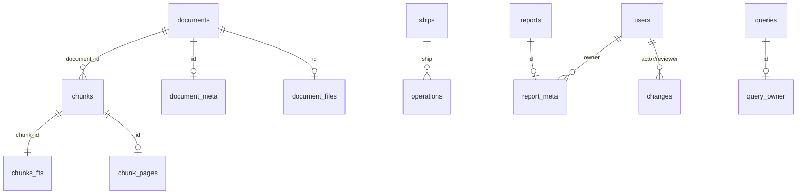

# 데이터 모델

> 대상 버전: 1.3.2 · 최종 확인: 2026-10-08 (`backend/db.mjs`, `backend/workspace.mjs` 대조)
> 테이블·필드·상태 값을 바꾸면 같은 작업에서 이 문서를 고치고, 되돌리기 어려운 변경이면 ADR을 남깁니다.

## 1. 저장소 개요

- **엔진**: Node.js 내장 `node:sqlite`(`DatabaseSync`), 파일 하나. `PRAGMA journal_mode=WAL`, `foreign_keys=ON`, `busy_timeout=5000`.
- **위치**: `HAEDAP_DB_PATH` → 없으면 `backend/data/haedap.sqlite`(옛 `data/haedap.sqlite`만 있으면 그것을 계속 사용, 둘 다 있으면 시작 중단). 규칙은 `backend/paths.mjs`.
- **스키마 버전 표시**: `PRAGMA user_version=1`(문서·검색 테이블), `settings.schema='2'`(작업공간 테이블). 스키마는 서버 시작 시 `CREATE TABLE IF NOT EXISTS`로 생성되며 별도 마이그레이션 도구는 없습니다.
- **두 계층**
  - 검색 계층(`db.mjs`): `documents`, `chunks`, `chunks_fts`, `reports`, `tool_runs`, `queries`
  - 작업공간 계층(`workspace.mjs`): 사용자·권한·메타데이터·운항·승인·감사·설정
- **JSON `body` 컬럼**: 선박·운항·문서 메타 등은 필드를 TEXT JSON으로 저장합니다. 검색·정렬에 쓰는 값(`ship`, `date` 등)만 별도 컬럼으로 뺍니다.



(관계선은 논리적 관계이며, 실제 외래키 제약은 `chunks.document_id → documents.id` 하나뿐입니다.)

## 2. 문서와 검색

### `documents` — 문서 개정본(revision) 단위

| 컬럼 | 타입 | 설명 |
|---|---|---|
| `id` | TEXT PK | 개정 ID = `{logical_id}-{hash 앞 16자}` |
| `logical_id` | TEXT | 논리 문서 ID (영문 소문자·숫자·하이픈). 같은 문서의 개정본이 공유 |
| `hash` | TEXT | 정규화한 문서 JSON의 SHA-256 (`haedap-chunk-v1` 접두). 같으면 `unchanged` |
| `title`, `reference`, `version` | TEXT | 제목, 출처 조항, 버전명 |
| `kind` | TEXT | `onboard` · `official-summary` · `sample` |
| `url` | TEXT NULL | HTTPS 원문 URL (`official-summary`는 필수) |
| `reviewed_at` | TEXT | 확인일 `YYYY-MM-DD` |
| `language` | TEXT | `ko` · `en` |
| `active` | INTEGER | 1 = 현재 개정본. `UNIQUE(logical_id) WHERE active=1`로 하나만 허용 |
| `imported_at` | TEXT | ISO 시각 |

### `chunks` / `chunks_fts` / `chunk_pages`

| 테이블 | 컬럼 | 설명 |
|---|---|---|
| `chunks` | `id`(=`{revision}-{n}`), `document_id`, `position`, `heading`, `text` | 절을 문장·줄 경계로 최대 900자씩 분할 |
| `chunks_fts` | `chunk_id` UNINDEXED, `terms` | FTS5 가상 테이블. `terms` = 제목·조항·소제목·본문의 토큰(단어, 한글 바이그램, 용어 사전 `conceptN`) |
| `chunk_pages` | `id`(청크 ID), `page` | PDF 물리 페이지 번호(없으면 NULL → "페이지 미지정") |

검색: 질문 토큰을 `"t1" OR "t2" …`로 MATCH → `bm25` 상위 30개 → 의미 있는 일치(용어 사전 또는 3자 이상 단어 1개, 또는 2개 이상 일치)만 남겨 최대 5개.

### `document_meta` / `document_files`

| 테이블 | 내용 |
|---|---|
| `document_meta(id, body)` | 개정본별 메타 JSON: `{scope, status, issuer, issuedAt, revisedAt, applicability, revision}` |
| `document_files(id, name, base64)` | 개정본의 원본 PDF (Base64, 25MB 이하). 새 개정에 파일이 없으면 이전 개정의 PDF를 복사 |

- `scope`: `all`(누구나) · `operator`(담당자·관리자) · `admin`(관리자만). 바꾸면 같은 논리 문서의 **모든 개정본**에 적용.
- `status`: `active`(사용 중) · `retired`(폐기) · `deleted`(삭제 — 행은 남기고 검색·열람에서 제외).
- `revision`: 메타 수정 시각(ms). 낙관적 잠금 `expectedMetaRevision`에 사용.
- 메타가 없으면 기본값 `{scope:'all', status:'active', …, revision:0}`.

## 3. 운항

### `ships(id, body, version)`

`body` 필드:

| 필드 | 타입 | 필수 | 비고 |
|---|---|---|---|
| `id` | string | 자동 | UUID |
| `name` | string | ✓ | ≤100자 |
| `type` | string | ✓ | 선종, ≤80자 |
| `dwt` | number | ✓ | 1 ~ 1e7 t |
| `imo`, `from`, `to` | string | | 선택 |
| `sample` | boolean | | 가상 예시 여부 |

### `operations(id, ship, date, body, version)` — `UNIQUE(ship, date)`

| 필드 | 단위 / 범위 | 필수 |
|---|---|---|
| `ship` | 등록된 선박 ID | ✓ |
| `date` | `YYYY-MM-DD` | ✓ |
| `fuel` | t, 0 ~ 1e7 | ✓ |
| `factor` | tCO₂/t 연료, 0 초과 ~ 10 | ✓ |
| `distance` | nm, 0 ~ 1e7 | ✓ |
| `speed` | kn, 0 ~ 100 | ✓ |
| `fuelType` | 문자열 | ✓ |
| `position`, `voyage`, `weather`, `note` | 문자열 | |
| `draft` | m, 0 ~ 40 또는 null | |
| `engineHours` | h, 0 ~ 24 또는 null | |
| `sample` | boolean | |

규칙: 같은 선박·일자는 한 건. 직전 기록보다 연료가 2배 이상이면 `note` 5자 이상 필요. CSV 일괄 등록은 1~1,000행, 한 행이라도 실패하면 전체 미반영.

파생 값(저장하지 않음, `analysis.summarize`): `emission = Σ fuel×factor`, `intensity = emission×1e6 / (dwt×distance)` gCO₂/(DWT·nm), `speed` = 평균. 공식 CII는 항상 `{status:'unavailable'}`.

## 4. 보고서

| 테이블 | 컬럼 | 설명 |
|---|---|---|
| `reports` | `id`, `title`(≤120), `type`, `text`(≤200,000), `sources`(문서 ID JSON 배열), `version`, `updated_at` | 본문 |
| `report_meta` | `id`, `owner`(사용자 ID 또는 `guest_…`), `status`, `body`(JSON) | 소유·상태 |

- `type`: `규정 검토` · `일일 운항` · `배출량 검토` · `종합 검토`
- `status` 전이: `draft` → (검토 요청) `review` → (승인) `approved` / (반려) `draft`. `review`·`approved`는 수정 불가 → 복사해 새 초안.
- `body`(≤50,000자 JSON): 생성 초안은 `{template:'noon'|'mrv', ship, from, to, recordIds:[{id,version}], sample}`, 승인 시 `approvedBy`, `approvedAt` 추가.
- 열람: 관리자, 소유자, 또는 `approved` — 단, `sources`의 모든 문서를 열람할 수 있어야 함.

## 5. 사용자·이력·운영

| 테이블 | 컬럼 | 설명 |
|---|---|---|
| `users` | `id`, `username`(UNIQUE), `name`, `role`, `password`(`salt:scrypt hex`), `active`, `version` | `role`: `admin`(로그인 가능) · `operator` · `viewer`(이전 버전 호환, 로그인 불가). 기본 `admin`은 고정 |
| `queries` | `id`, `question`, `response`(통합 답변 JSON 전체), `created_at` | 질문 당시 답변 재열람용 |
| `query_owner` | `id`, `owner` | 질문 소유자 |
| `tool_runs` | `id`, `tool`, `version`, `input`, `output`, `created_at` | 계산 도구 실행 기록 |
| `changes` | `id`, `at`, `actor`, `kind`, `payload`, `status`, `reviewer`, `reviewed_at`, `note` | 변경·승인 이력 |
| `audit` | `id`, `at`, `actor`(이름), `category`, `action`, `target`, `detail`(JSON) | 감사 로그 (관리 화면 최근 500건) |
| `settings` | `key`, `value` | 아래 키 참고 |

`changes.kind`: `document.save`, `document.delete`, `ship.save`, `operation.save`, `operation.import`, `operation.delete`, `report.approve`.
`changes.status`: 관리자 직접 변경은 즉시 `approved`로 기록. 보고서 검토 요청(및 이전 버전의 요청)은 `pending` → `approved` / `rejected`.

`settings` 키: `schema`(`'2'`), `autoBackup`(`daily`|`off`), `autoBackupDay`(마지막 자동 백업 UTC 날짜), `publicAccessV1`(기본 관리자 일회성 이전 완료 표시).

## 6. 식별자와 동시성

- 대부분의 ID는 `randomUUID()`. 문서는 내용 해시 기반 개정 ID.
- **낙관적 잠금**: `ships`, `operations`, `reports`, `users`는 `version` 정수를 갖고, 요청의 `version`이 DB와 다르면 `409 VERSION_CONFLICT`. 저장 시 +1. 문서는 `expectedId`(현재 개정 ID)와 `expectedMetaRevision`으로 같은 검사를 합니다.
- 변경은 `BEGIN IMMEDIATE` 트랜잭션 하나로 처리(`workspace.transaction`).
- 일반 사용자 소유자 ID: `guest_` + `haedap_guest` 쿠키 값의 SHA-256.

## 7. 백업 형식

DB 옆 `backups/{uuid}.json`.

```json
{
  "format": "haedap-workspace",
  "version": 2,
  "createdAt": "2026-10-08T00:00:00.000Z",
  "label": "수동 백업",
  "tables": { "documents": [], "chunks": [], "reports": [], "tool_runs": [], "queries": [],
              "users": [], "document_meta": [], "document_files": [], "chunk_pages": [],
              "ships": [], "operations": [], "report_meta": [], "audit": [], "query_owner": [],
              "changes": [], "settings": [] },
  "checksum": "checksum 필드를 뺀 나머지 JSON의 SHA-256 hex"
}
```

- `chunks_fts`는 백업하지 않고 복구 시 재생성합니다.
- 복구 조건: `format`·`version:2`·체크섬 일치, 16개 테이블 모두 존재, 활성 관리자 1명 이상. 복구 직전 자동 백업을 만들고 한 트랜잭션에서 전체 교체합니다.
- `.env`(API 키)는 포함하지 않습니다.

## 8. 스키마를 바꿀 때

1. 새 컬럼·테이블은 `CREATE TABLE IF NOT EXISTS` / 조건부 `ALTER TABLE`로 기존 DB에서도 열리게 합니다.
2. 백업 대상이면 `workspace.mjs`의 `backupTables`에 추가하고, 이전 백업 복구 시의 동작을 정합니다(백업 `version`을 올릴지 결정 → ADR).
3. `settings.schema` 또는 `user_version`을 올리고 이 문서의 해당 절을 갱신합니다.
4. `backend/tests/`에 기존 DB 이전 회귀 테스트를 추가합니다.
